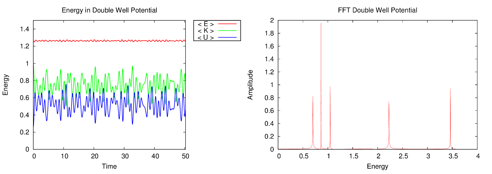

# Time Evolution of a Wavefunction

A project for a computational physics course on quantum mechanics. Using the
Feynmann path integral formalism (properly discretized), a wavefunction is
simulated in both a simple harmonic and double well potential.

Nearly all of the computation in the program is done on the GPU. The
calculations are written in CUDA with the help of cuBLAS, cuFFT
[CULA](http://www.culatools.com/), and
[Thrust](https://code.google.com/p/thrust/). Visualization of the simulation is
done with OpenGL. This was my first real project using any of these
libraries/languages, so the code isn't as well organized or as well documented
as I would like. This is something that I would change if I decide to revisit
this project, though I am very proud of the code that I was able to produce
from all that I had learned in the short few weeks of this assignment.

## Some Theory and Technical Descriptions

The infinitesimal time propagator is constructed from the action of the system
which depends on the potential well in which the particle sits. Since the
spatial dimension is discretized, the propagator becomes a matrix. Each matrix
element is related to the transfer probability from one point in the well to
another in the given time period. In essence, the propagator tells us how to
advance the wavefunction in time. Therefore, advancing the system boils down to
matrix vector multiplication, which was accelerated using cuBLAS.

The propagator contains all of information of the system and its potential
including the energy spectrum of the well. Taking the trace of the propagator
(and applying a Wick rotation into imaginary time) yields the partition
function from statistical mechanics of a related classical system. By computing
this value over a series of time values (which is analogous to different
temperatures) and taking the inverse Fourier transformation, the complete
energy spectrum falls out.

Performing this calculation can be greatly simplified by determining the
eigenvalues of the infinitesimal propagator. This is where the CULA library
comes in. CULA is essentially an accelerated LAPACK port to the GPU. By
diagonalizing the infinitesimal propagator, repeated matrix-matrix
multiplication simplifies to increasing the power of the eigenvalues.

Clearly, this is a shallow and incomplete explanation of the theory. Its
purpose is to give a brief introduction to the ideas and a basic description
of the computational methods used in the code. For more information on the
path integral formulation, you can begin your search on
[Wikipedia](http://en.wikipedia.org/wiki/Path_integral_formulation)

## Results

The simulation produces an OpenGL animation of the wavefunction and is able
to compute the potential, kinetic, and total energy of the particle as a
function of time. These results are shown below for both the harmonic well
and the double well.

## License

If you happen to find this project useful, you are welcome to use it. Simply
drop me an email to make me feel good about myself if you do and adhere to the
MIT License below.

The MIT License (MIT)

Copyright (c) 2014 Travis Johnson

Permission is hereby granted, free of charge, to any person obtaining a copy
of this software and associated documentation files (the "Software"), to deal
in the Software without restriction, including without limitation the rights
to use, copy, modify, merge, publish, distribute, sublicense, and/or sell
copies of the Software, and to permit persons to whom the Software is
furnished to do so, subject to the following conditions:

The above copyright notice and this permission notice shall be included in all
copies or substantial portions of the Software.

THE SOFTWARE IS PROVIDED "AS IS", WITHOUT WARRANTY OF ANY KIND, EXPRESS OR
IMPLIED, INCLUDING BUT NOT LIMITED TO THE WARRANTIES OF MERCHANTABILITY,
FITNESS FOR A PARTICULAR PURPOSE AND NONINFRINGEMENT. IN NO EVENT SHALL THE
AUTHORS OR COPYRIGHT HOLDERS BE LIABLE FOR ANY CLAIM, DAMAGES OR OTHER
LIABILITY, WHETHER IN AN ACTION OF CONTRACT, TORT OR OTHERWISE, ARISING FROM,
OUT OF OR IN CONNECTION WITH THE SOFTWARE OR THE USE OR OTHER DEALINGS IN THE
SOFTWARE.
